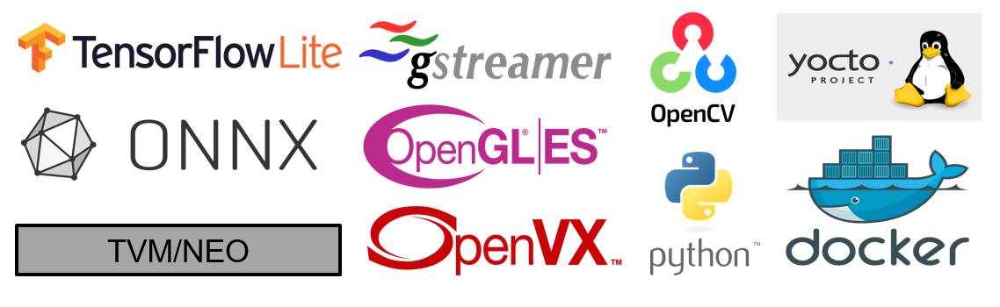
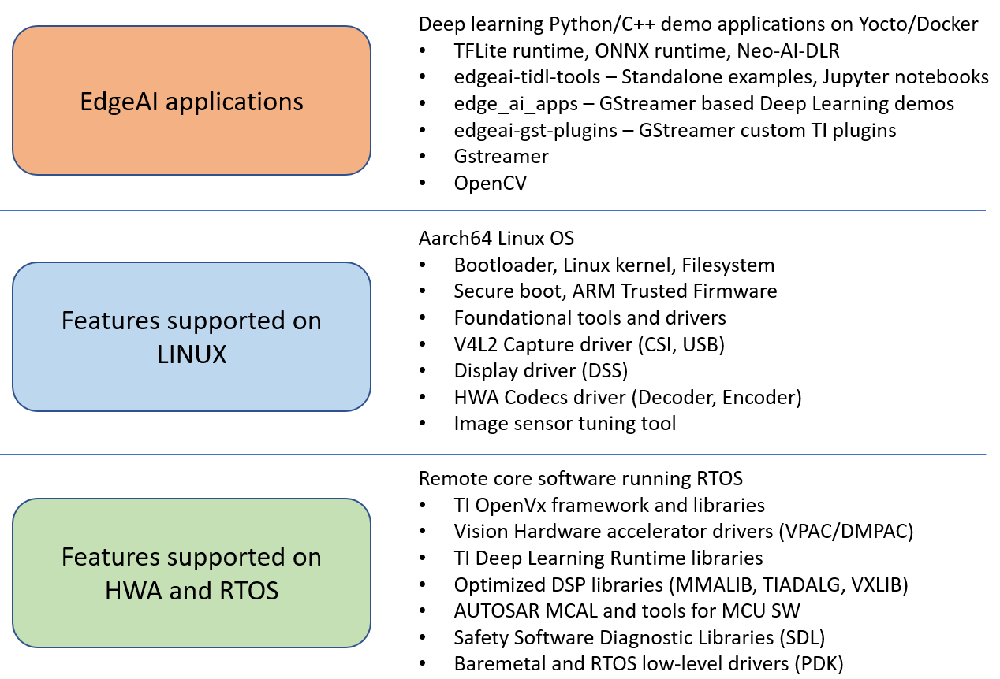

.. _pub_edgeai_devkit:

===============================
Processor SDK Linux for Edge AI
===============================

Overview
========

**Welcome to Processor SDK Linux for Edge AI!**

The SDK provides software and tools to let the user effectively balance deep learning
performance with system power and cost on Texas Instrument’s processors for
edge AI applications such as latest TDA4 class of SoCs. We offer a practical
embedded inference solution for next-generation vehicles, smart cameras,
edge AI boxes, and autonomous machines and robots. In addition to general
compute core and deep learning cores accelerator, our processors for edge AI
integrate imaging, vision, multimedia cores, hardware accelerators and with
security enablers and optional microcontrollers for applications that
require SIL-3 and ASIL-D functional safety certifications. With a few simple
steps one can run high performance computer vision and deep learning demos
using a live camera and display.

.. |pic1| image:: ./images/edgeai-overview-image1.jpg
   :align: middle
.. |pic2| image:: ./images/edgeai-overview-image2.jpg
   :align: middle

+--------+--------+--------+
| |pic1| | |pic2| | |pic3| |
+--------+--------+--------+

.. figure:: ./images/edgeai-sdk-feature.png
   :scale: 50
   :align: center

   Processor SDK Linux for Edge AI Feature Overview

The SDK also enables an interplay of multiple open-source components such as
GStreamer, OpenVx, OpenCV and Deep Learning Runtime such as TFLite, ONNX and
Neo-AI DLR.

    Industry Standard Components supported in Processor SDK Linux for Edge AI

The reference applications showcase perception based examples such as image
classification, object detection and semantic segmentation in both Python and C++
variants. The SDK supports edit-build-debug cycles directly
on the target without needing a PC to cross compile and build the applications.
The SDK also supports running the applications using Ubuntu 20.04 Docker which
allows users to download and install any supported packages from APT and PyPI
repositories. The Processor SDK Linux for Edge AI packages TI's Processor SDK Linux,
Processor SDK RTOS and a rich set of applications to quickly evaluate and experience
Deep Learning technologies on TI's latest TDA4 SoC.

   Processor SDK Linux for Edge AI - Applications, RTOS and Linux Features

To get more information on individual components visit :ref:`pub_edgeai_sdk_components`.
To get started with the setup click the **Next** button.
